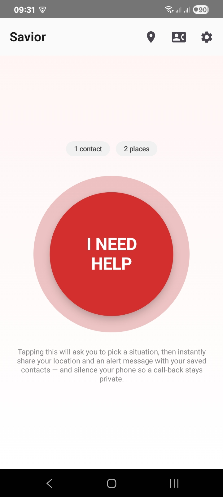
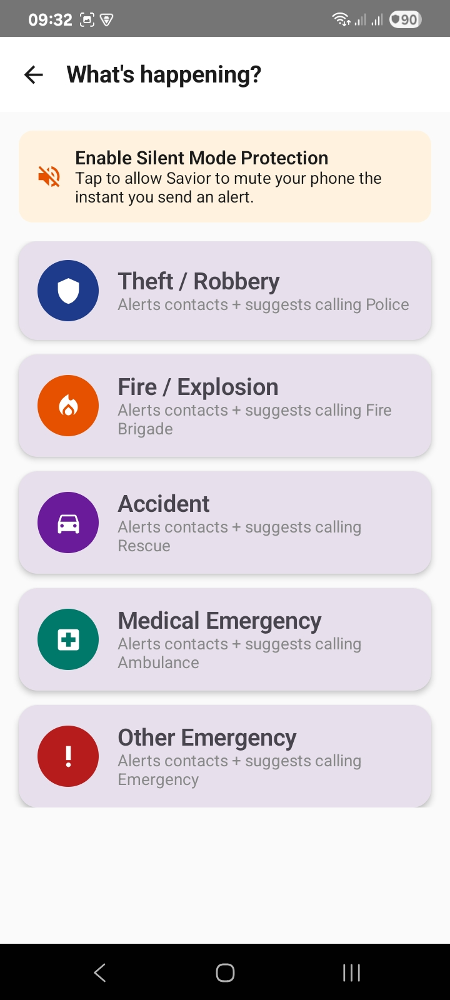
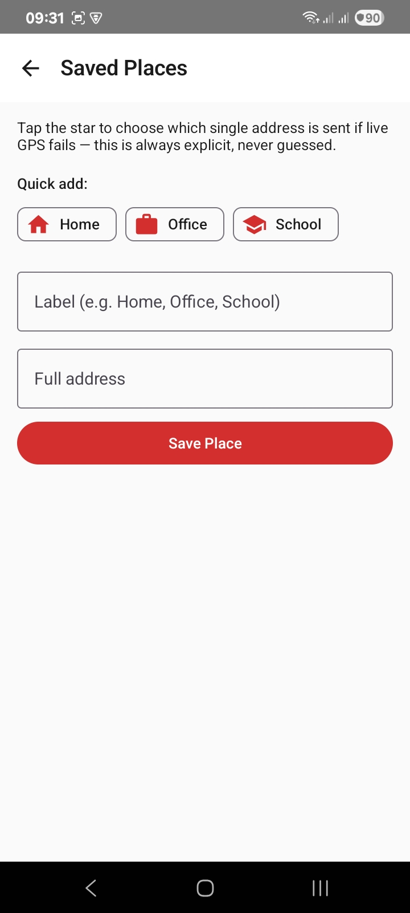
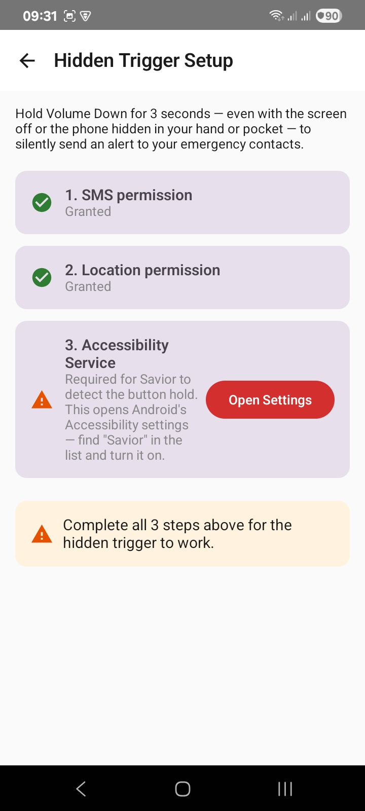

# Savior — One-Tap Emergency Alert App

Savior is a personal safety app: in an emergency (theft, fire/explosion, accident, or
medical situation), a single flow lets the user alert their saved emergency contacts
with their live location and a situation-specific message, and points them to the
right emergency service to call.

This is a personal rebuild of an app concept I originally delivered for a private
client (Java/XML), reimplemented from scratch in Kotlin + Jetpack Compose as an
open-source portfolio project — no client code, data, or branding included.

## Screenshots

| Home | Situation Picker | Saved Places | Hidden Trigger Setup |
|---|---|---|---|
|  |  |  |  |

## Features

- **One-tap emergency trigger** from the home screen
- **Situation picker** — Theft, Fire/Explosion, Accident, or Medical, each with its
  own color, icon, alert wording, and mapped emergency service number
- **Live location sharing** — fetches current location and includes a Google Maps
  link in the alert SMS
- **Saved Places (offline fallback)** — save Home, Office, School, or custom addresses
  as plain text. One place is explicitly marked as the **default** (starred) — used
  automatically if live GPS is unavailable, so the fallback is always intentional,
  never guessed. Works with zero internet, since it's just text sent over SMS.
- **Silent Mode on trigger** — the instant an alert is sent, the phone's ringer is
  silenced (via Do Not Disturb access), so an incoming call-back from a contact or
  responder doesn't ring out loud and risk exposing the user's location to whoever
  caused the emergency
- **Hidden Trigger (Volume Button)** — hold Volume Down for 3 seconds, even with the
  screen off or the phone hidden in a pocket/hand, to silently send the alert with no
  UI interaction at all. Built on Android's Accessibility Service key-event filtering
  (the same mechanism real safety apps like bSafe use) since Android does not expose
  raw power-button presses to any third-party app. Requires a one-time manual grant
  in Accessibility Settings — guided via the in-app setup screen.
- **Up to 5 emergency contacts**, stored locally on-device
- **Direct dial shortcut** to the relevant emergency service after sending

## Tech Stack

- Kotlin
- Jetpack Compose + Material 3
- Navigation Compose
- Fused Location Provider (Google Play Services)
- AudioManager + NotificationManager (Do Not Disturb access) for Silent Mode
- SharedPreferences for local contact/place storage (no backend — fully offline-capable)

## Project Structure

```
app/src/main/java/com/tahirabbas/savior/
├── MainActivity.kt
├── data/
│   ├── EmergencyContact.kt
│   ├── ContactRepository.kt
│   ├── SavedPlace.kt
│   ├── SavedPlaceRepository.kt
│   └── SituationType.kt
├── utils/
│   ├── LocationHelper.kt
│   ├── SmsHelper.kt
│   └── SilentModeHelper.kt
├── navigation/
│   └── NavGraph.kt
└── ui/
    ├── theme/
    └── screens/
        ├── HomeScreen.kt
        ├── ContactSetupScreen.kt
        ├── SavedPlacesScreen.kt
        ├── SituationPickerScreen.kt
        └── SettingsScreen.kt
```

## Running it

1. Open the project root folder in Android Studio (Hedgehog or newer).
2. Let Gradle sync (it will pull the dependencies listed in `app/build.gradle.kts`).
3. Run on a device or emulator with Google Play Services (needed for location).
4. On first launch: add at least one emergency contact via the contacts icon,
   then use the home screen button to test the alert flow.

## Notes

- Emergency service numbers currently default to Pakistan (Police 15, Rescue/Ambulance
  1122, Fire 16) — see `SituationType.kt` to adjust for another country.
- SMS sending requires a physical device or an emulator with SMS capability;
  most emulators cannot actually send SMS, but the permission flow and message
  construction can still be tested.
- **Silent Mode requires a one-time manual grant**: Android restricts ringer control
  behind "Do Not Disturb access" (`ACCESS_NOTIFICATION_POLICY`), which can't be
  requested as a normal runtime permission — the app links directly to the system
  settings screen for this (see the banner on the Situation Picker screen if not yet granted).
- Saved Places are deliberately plain-text (no geocoding/API call) so they work
  with zero internet connectivity — only cellular signal for the SMS itself is needed.
- **Hidden Trigger requires all 3 setup steps** (SMS permission, location permission,
  Accessibility Service) — the in-app "Hidden Trigger Setup" screen (under Settings)
  shows exactly which are missing. The Accessibility Service only reads key events
  for Volume Down; it does not read screen content or other apps' data.
